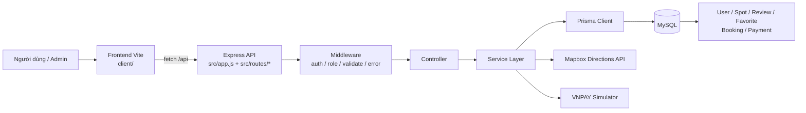
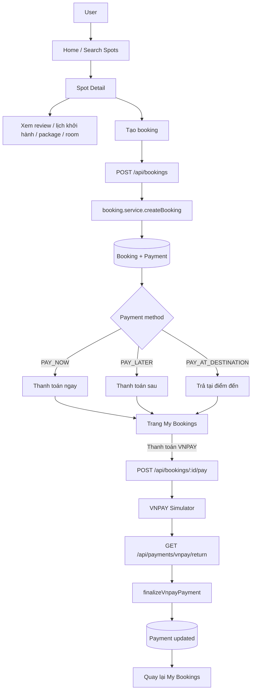
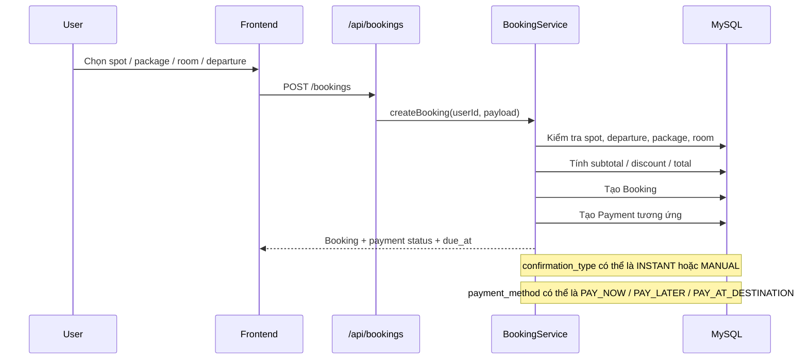
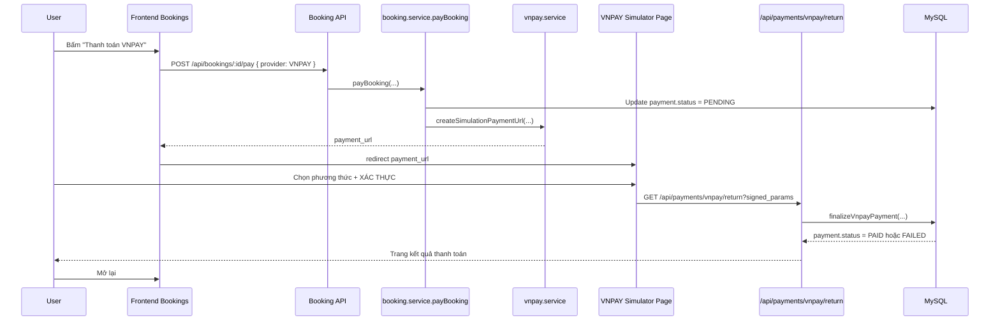
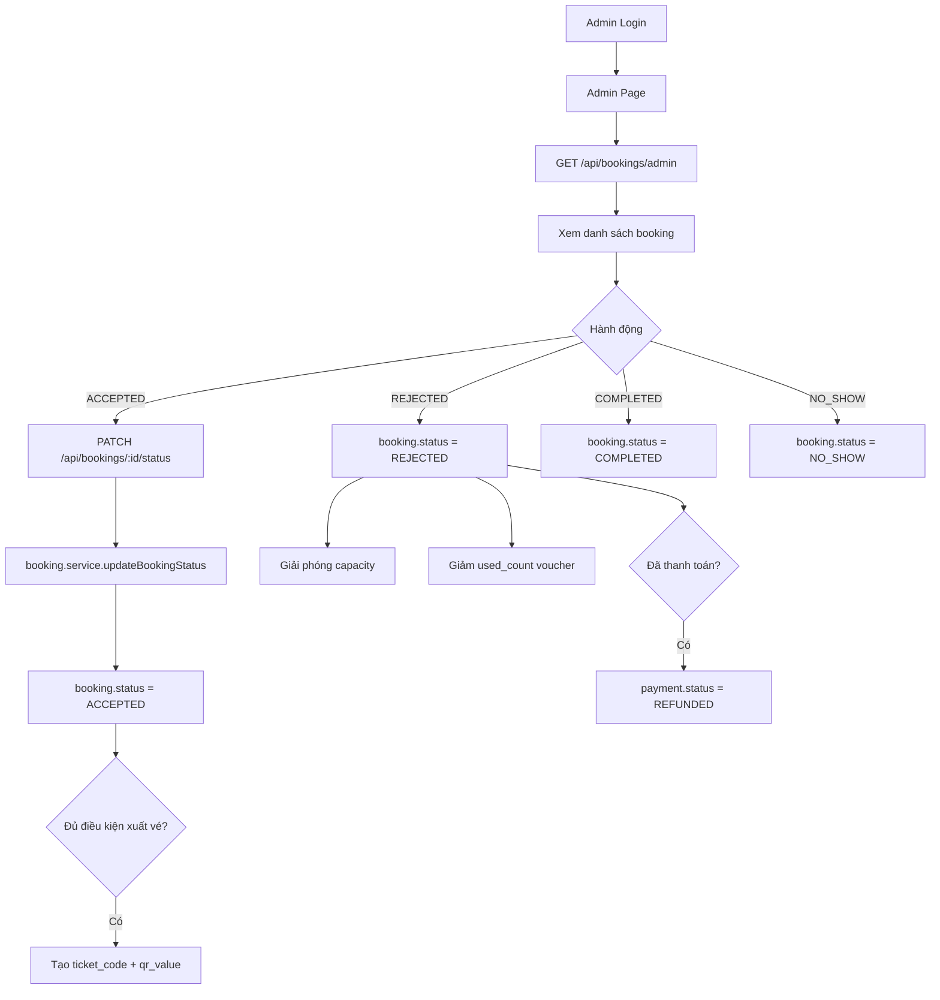
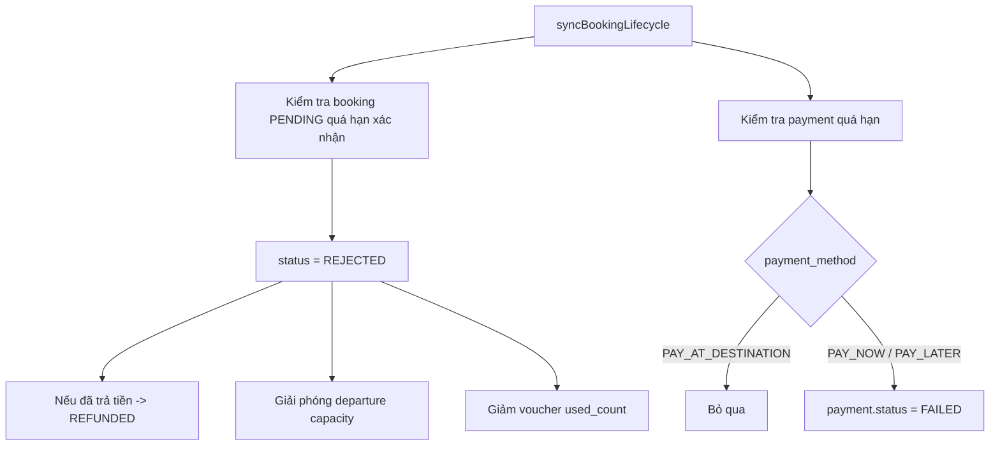
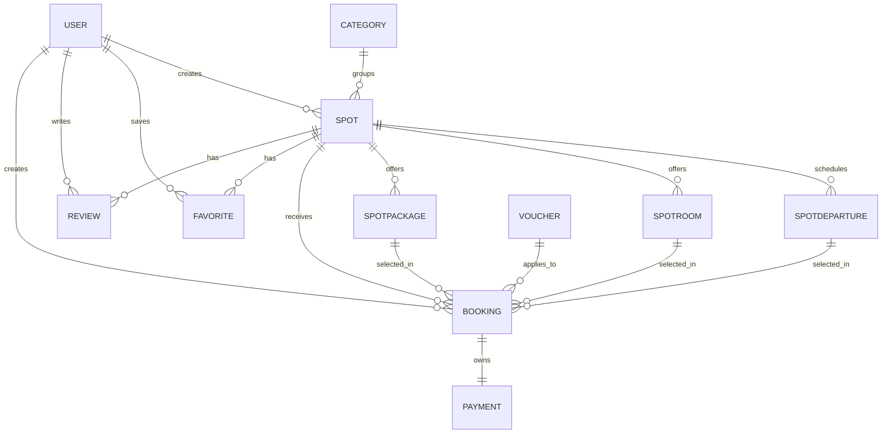

# Sơ Đồ Hoạt Động Project

Tài liệu này mô tả luồng hoạt động chính của project `TravelSpotFinder-API` theo code hiện tại.

## 1. Kiến trúc tổng thể



## 2. Luồng request backend

```mermaid
flowchart TD
    A[Client gọi API] --> B[src/app.js]
    B --> C[/api]
    C --> D[src/routes/index.js]
    D --> E[Route module]
    E --> F[authenticate?]
    F --> G[authorizeRoles?]
    G --> H[validate Zod?]
    H --> I[Controller]
    I --> J[Service]
    J --> K[Prisma / External API]
    K --> L[successResponse / JSON]
    J --> M[throw Error]
    M --> N[globalErrorHandler]
    N --> O[JSON error]
```

## 3. Luồng người dùng chính



## 4. Luồng booking chi tiết



## 5. Luồng thanh toán VNPAY giả lập



## 6. Luồng admin duyệt booking



## 7. Luồng lifecycle tự động của booking



## 8. Quan hệ dữ liệu chính



## 9. Thành phần chính theo thư mục

```text
client/
  main.js
  src/router.js
  src/api.js
  src/pages/Home.js
  src/pages/SpotDetail.js
  src/pages/Bookings.js
  src/pages/Admin.js

src/
  app.js
  server.js
  routes/
  controllers/
  services/
  middlewares/
  validations/
  config/

prisma/
  schema.prisma
  migrations/
  seed.js
```

## 10. Gợi ý đọc project theo thứ tự

1. `README.md`
2. `src/app.js`
3. `src/routes/index.js`
4. `src/services/spot.service.js`
5. `src/services/booking.service.js`
6. `src/controllers/payment.controller.js`
7. `client/src/router.js`
8. `client/src/api.js`
9. `client/src/pages/SpotDetail.js`
10. `client/src/pages/Bookings.js`
11. `client/src/pages/Admin.js`
